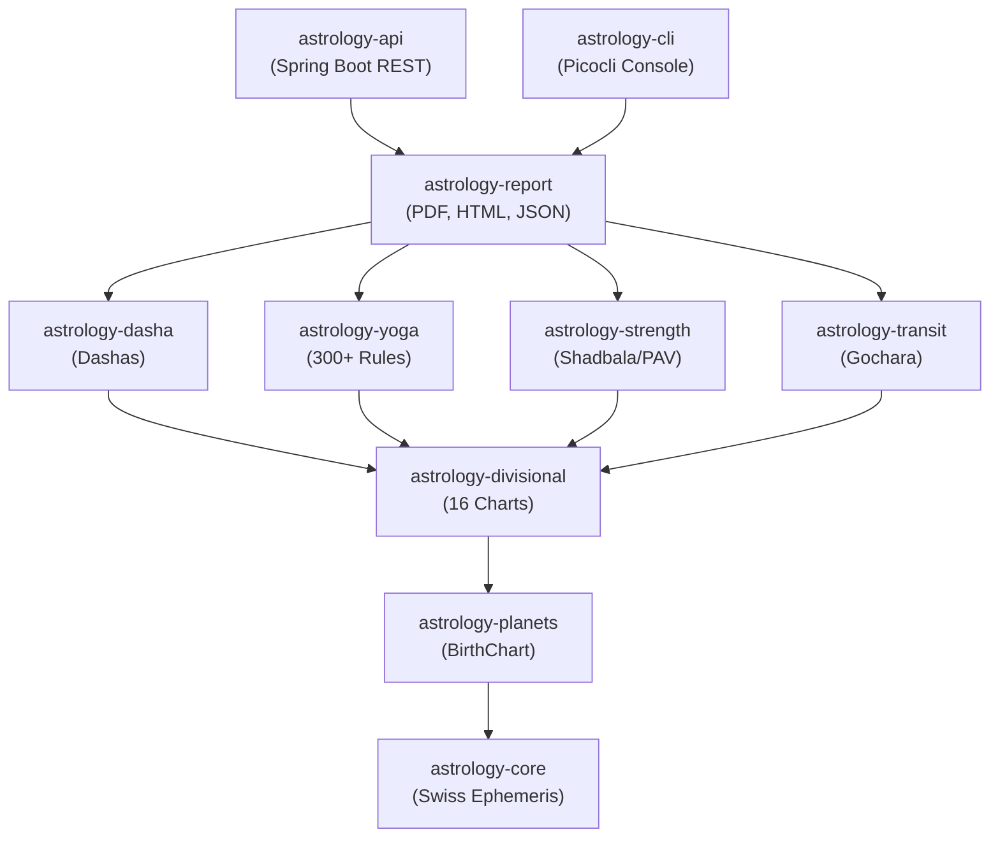
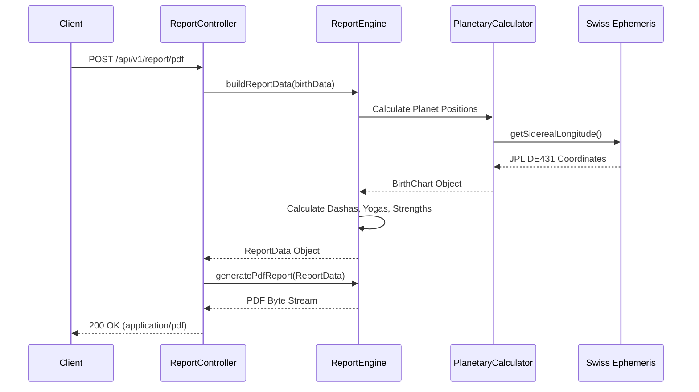

# Vedic Astrology Engine

A **production-quality Vedic Astrology (Jyotish) Engine** built in Java 21 with Maven multi-module architecture. Provides Swiss Ephemeris integration, 16 divisional charts, 300+ yoga detection rules, complete dasha systems (Vimshottari, Yogini, Jaimini), Shadbala, Ashtakavarga, a transit engine, and professional PDF/HTML/JSON reports.

---

## Project Structure

```
vedic-astrology/
├── astrology-core          ← Swiss Ephemeris wrapper, enums, utilities
├── astrology-planets       ← Planetary positions, houses, ascendant
├── astrology-divisional    ← 16 divisional charts (D1–D60)
├── astrology-dasha         ← Vimshottari, Yogini, Jaimini dashas
├── astrology-yoga          ← 300+ yoga detection rules
├── astrology-strength      ← Shadbala + Ashtakavarga
├── astrology-transit       ← Transit engine + Gochara
├── astrology-report        ← PDF, HTML, JSON reports
├── astrology-api           ← Spring Boot 3 REST API
├── astrology-cli           ← Picocli command-line interface
└── ephe/                   ← Swiss Ephemeris data files (user-provided)
```

---

## Quick Start

### Prerequisites
- **Java 21** (JDK)
- **Maven 3.9+**
- **Swiss Ephemeris data files** in `./ephe/` (optional — falls back to Moshier mode)

### Build
```bash
mvn clean install -DskipTests
```

### Run API Server
```bash
cd astrology-api
mvn spring-boot:run
# API available at http://localhost:8080
# Swagger UI at http://localhost:8080/swagger-ui.html
```

### Run CLI
```bash
java -jar astrology-cli/target/astrology-cli-1.0.0-jar-with-dependencies.jar --help
```

---

## CLI Usage

```bash
# Full natal chart
astro chart \
  --date 1990-07-15 \
  --time 14:30:00 \
  --tz Asia/Kolkata \
  --lat 28.6139 \
  --lon 77.2090 \
  --name "Sample Person"

# Vimshottari Dasha (next 30 years)
astro dasha \
  --date 1990-07-15 --time 14:30:00 \
  --tz Asia/Kolkata --lat 28.61 --lon 77.20 \
  --years 30 --levels 3

# Detect yogas
astro yoga \
  --date 1990-07-15 --time 14:30:00 \
  --tz Asia/Kolkata --lat 28.61 --lon 77.20

# Generate PDF report
astro report \
  --date 1990-07-15 --time 14:30:00 \
  --tz Asia/Kolkata --lat 28.61 --lon 77.20 \
  --format PDF --output my-kundli

# Transit analysis
astro transit \
  --date 1990-07-15 --time 14:30:00 \
  --tz Asia/Kolkata --lat 28.61 --lon 77.20 \
  --transit-date 2024-01-01 --gochara
```

---

## REST API

### Calculate Birth Chart
```http
POST /api/v1/chart
Content-Type: application/json

{
  "name": "Sample Person",
  "dateTime": "1990-07-15T14:30:00",
  "timezone": "Asia/Kolkata",
  "latitude": 28.6139,
  "longitude": 77.2090,
  "ayanamshaType": "LAHIRI",
  "houseSystem": "WHOLE_SIGN"
}
```

### Get Vimshottari Dasha
```http
POST /api/v1/dasha/vimshottari?yearsAhead=25
Content-Type: application/json
{ ... same birth data ... }
```

### Download PDF Report
```http
POST /api/v1/report/pdf
Content-Type: application/json
{ ... same birth data ... }
→ Returns: application/pdf binary
```

### Full API endpoints
| Method | Endpoint | Description |
|--------|----------|-------------|
| POST | `/api/v1/chart` | Full natal chart |
| POST | `/api/v1/chart/divisional/{1-60}` | Specific divisional chart |
| POST | `/api/v1/chart/all-divisional` | All 16 divisional charts |
| POST | `/api/v1/dasha/vimshottari` | Vimshottari dasha |
| POST | `/api/v1/dasha/yogini` | Yogini dasha |
| POST | `/api/v1/dasha/jaimini` | Jaimini Chara dasha |
| POST | `/api/v1/dasha/current` | Current running period |
| POST | `/api/v1/yogas` | All detected yogas |
| POST | `/api/v1/yogas/category/{cat}` | Yogas by category |
| POST | `/api/v1/strength/shadbala` | Shadbala calculation |
| POST | `/api/v1/strength/ashtakavarga` | Ashtakavarga bindus |
| POST | `/api/v1/transit` | Transit chart |
| POST | `/api/v1/transit/gochara` | Gochara results |
| POST | `/api/v1/report/pdf` | PDF report download |
| POST | `/api/v1/report/html` | HTML report |
| POST | `/api/v1/report/json` | JSON report |

---

## Features

### Swiss Ephemeris Integration
- Pure Java port (no native libraries required)
- Supports Lahiri, Raman, Krishnamurti, Fagan-Bradley ayanamshas
- Falls back to Moshier analytical mode without `.se1` data files
- Thread-safe `ThreadLocal<SwissEph>` instances

### Planetary Calculations
- 9 classical planets + Rahu/Ketu + Upagrahas (Gulika, Mandi)
- Tropical → Sidereal conversion with configurable ayanamsha
- Speed, retrograde, combust detection
- Nakshatra (27), Pada (4), dignity status

### 16 Divisional Charts (Shodashavarga)
| Chart | Purpose |
|-------|---------|
| D1 Rasi | Physical body, general life |
| D2 Hora | Wealth, finances |
| D3 Drekkana | Siblings, courage |
| D4 Chaturthamsa | Fortune, property |
| D7 Saptamsa | Children |
| **D9 Navamsa** | **Soul, marriage, dharma** |
| D10 Dasamsa | Career, profession |
| D12 Dwadasamsa | Parents |
| D16 Shodasamsa | Vehicles, happiness |
| D20 Vimshamsa | Spirituality |
| D24 Siddhamsa | Education |
| D27 Nakshatramsa | Strength, vitality |
| D30 Trimshamsa | Evils, misfortune |
| D40 Khavedamsa | Maternal legacy |
| D45 Akshavedamsa | Paternal legacy |
| D60 Shashtiamsa | Past karma |

### Dasha Systems
- **Vimshottari**: 120-year cycle, 5 levels (MD→AD→PD→Sookshma→Prana)
- **Yogini**: 36-year cycle, 8 yoginis
- **Jaimini Chara**: Sign-based dasha
- **Kalachakra**: Navamsa-based (stub)

### Yoga Detection (300+)
- Pancha Mahapurusha (5): Ruchaka, Bhadra, Hamsa, Malavya, Sasa
- Raja Yogas (20+): Lord combinations of trikona + kendra
- Dhana Yogas (10+): Wealth combinations
- Viparita Raja Yogas (3): Harsha, Sarala, Vimala
- Nabhasya Yogas (18): Rajju, Musala, Nala, Mala, etc.
- Lunar Yogas (8): Gajakesari, Sunapha, Anapha, Durudhura, Kemadruma
- Solar Yogas: Vesi, Vasi, BudhAditya
- Dosha Yogas: Mangal Dosha, Kala Sarpa, Shakat
- Special Yogas: Saraswati, Amala, Parvata, etc.

### Shadbala (6-fold Strength)
1. **Sthana Bala**: Exaltation, Moolatrikona, Sign dignities
2. **Dig Bala**: Directional strength from house position
3. **Kala Bala**: Temporal (day/night, paksha, hora, weekday, month, year)
4. **Chesta Bala**: Motional (retrograde/direct speed)
5. **Naisargika Bala**: Natural fixed strengths
6. **Drik Bala**: Aspectual from other planets

### Ashtakavarga
- Bhinna Ashtakavarga (8 individual planet grids × 12 signs)
- Sarvashtakavarga (sum total)
- Trikona Shodhana (trine reduction)
- Ekadhipatya Shodhana (dual-owner reduction)
- Sodhita Pinda (purified strength values)
- Transit bindu analysis

### Transit Engine
- Planet positions at any date
- Transit-to-natal aspect detection
- Gochara (transit) results from natal Moon
- Sade Sati detection (7.5-year Saturn transit)
- Ashtakavarga transit bindu check

### Professional Reports
- **PDF**: 6-page multi-section report with charts, tables, and color coding
- **HTML**: Dark-themed responsive web page with CSS charts
- **JSON**: Complete structured output for integration

---

## Swiss Ephemeris Data Files

For highest precision (JPL DE431 accuracy), download the `.se1` ephemeris data files from:
- https://www.astro.com/swisseph/swefiles.zip

Place them in `./ephe/` relative to where you run the application. Without them, the engine falls back to Moshier analytical mode (accuracy ~0.1 arcsecond — sufficient for astrological purposes).

---

## Architecture & Workflow

### Component Diagram



### Request Workflow



---

## Configuration

`application.yml` (API module):
```yaml
astrology:
  ephe-path: ./ephe          # Path to Swiss Ephemeris .se1 files
  default-ayanamsha: LAHIRI  # LAHIRI, RAMAN, KP, FAGAN_BRADLEY
  default-house-system: WHOLE_SIGN  # WHOLE_SIGN, PLACIDUS, EQUAL, KOCH
```

---

## Testing

```bash
# Run all tests
mvn test

# Run specific module tests
mvn test -pl astrology-core
mvn test -pl astrology-planets
mvn test -pl astrology-dasha

# Run integration tests
mvn verify
```

---

## License

MIT License — See LICENSE file.

Includes **swisseph** Java port by Thomas Mack (GPL/commercial dual license from Astrodienst).
